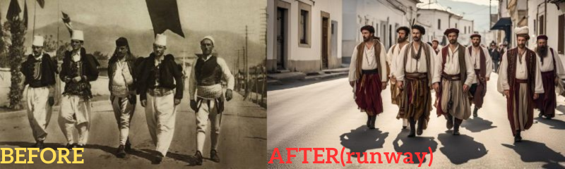

# clip-interrogator-demo


画像からテキストプロンプトを抽出する書き捨てコード

※ 右画像は左画像からテキストプロンプトを抽出して、生成した結果です。

## Example of output by KLING AI
<video src="./assets/videos/example.mp4" controls="true" muted autoplay playsinline loop></video>

※ 画像からテキストプロンプトを抽出して mp4 ファイルにした動画

## Usage
```sh
git clone https://github.com/Ant2357/clip-interrogator-demo
cd clip-interrogator-demo

# 簡略化の為に書いてないけど、基本は venv 等使って
pip install -r requirements.txt
# テキストプロンプト抽出
python main.py

```
